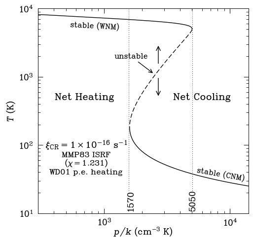
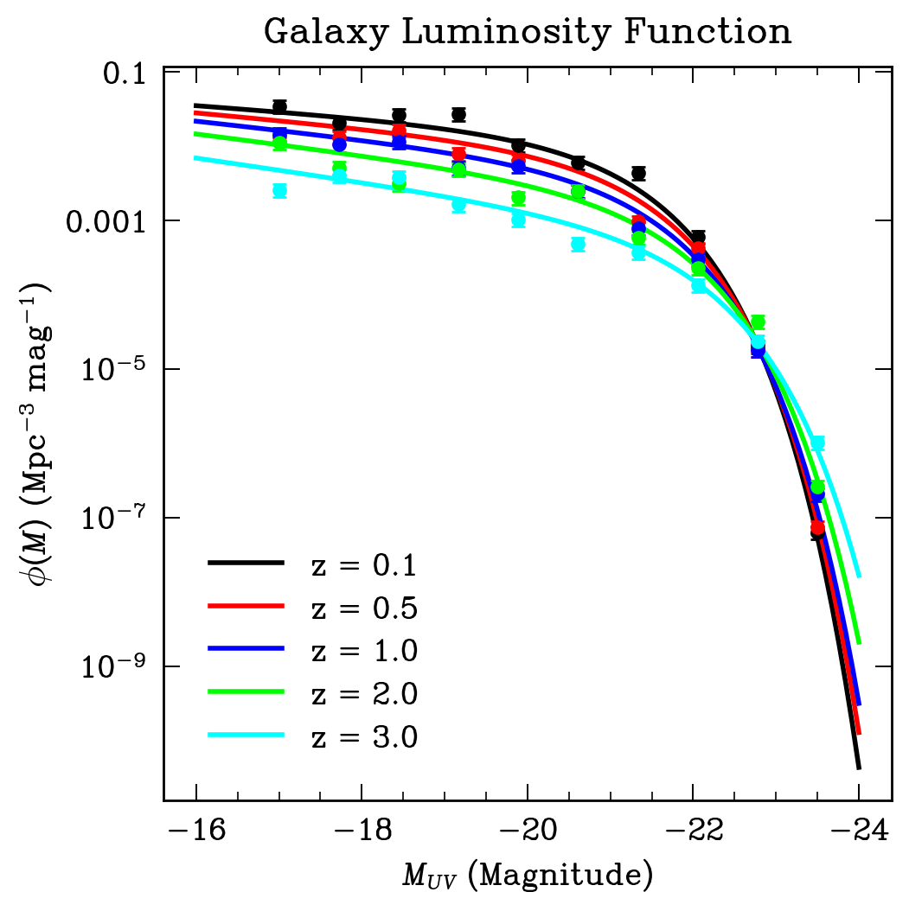
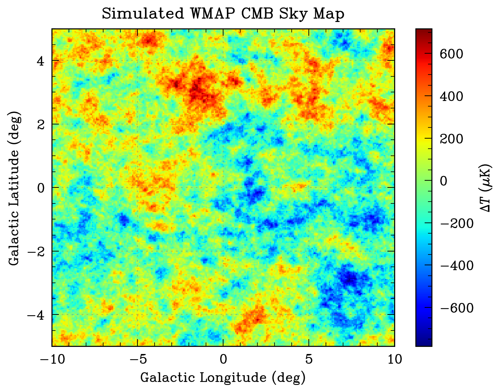

# smplotlib
[](https://zenodo.org/badge/latestdoi/627675650) [](https://pepy.tech/project/smplotlib) [](https://badge.fury.io/py/smplotlib) [](https://opensource.org/licenses/MIT)

Matplotlib template for [SuperMongo (SM)](https://www.astro.princeton.edu/~rhl/sm/) style. Make your plots stylish and professional (and old-school) by one line of code.

## Installation

```bash
pip install smplotlib
```
or 
```bash
git clone
cd smplotlib
pip install -e . --user
```

## Usage
```python
import smplotlib
```
Then just use `matplotlib.pyplot` as usual. For a quick start, you can use `smplotlib.demo_plot()` to generate a figure with the default settings. This figure is inspired by the two-phase ISM figure in Prof. Bruce Draine's [book](https://www.astro.princeton.edu/~draine/book/index.html), but the cooling curve doesn't correspond to the actual CR rates and ISRF.

<p float="left">
  
  
   
</p>


### More advanced usage
You can use the function ``smplotlib.set_style(fontweight='normal', usetex=False, fontsize=15, figsize=(6, 6), dpi=120)`` to customize the global seetings including font weight, font size, default figure size and resolution, and whether using LaTeX for math. The default font weight is ``'normal'``, and the default setting for LaTeX is ``False``. You can specify font weight as ``'light'`` or ``'heavy'``. Current support for LaTeX is not quite satisfying, so it is recommended to set ``usetex=False``.

You can turn off the black edgecolor of scatter plots by ``smplotlib.set_style(edgecolor='face')``. This is useful when you want to plot a large number of points.

## Hershey font
SuperMongo uses [Hershey fonts](https://www.astro.princeton.edu/~rhl/sm/sm.html#TOC73). The [``ttf`` files](https://github.com/yangcht/Hershey_font_TTF) are from a compilation by astronomer [`yangcht`](https://github.com/yangcht). Thanks for the great work! 

There have been many [efforts](https://retrocomputingforum.com/t/hershey-fonts-the-original-vector-fonts/1852) on translating the [original](http://paulbourke.net/dataformats/hershey/) Hershey font to modern formats, also see [this](https://github.com/Dener-Silva/Hershey-TTF) and [this](https://github.com/scruss/AVHershey-OTF). The font files in this repo still lack some characters, and the support for LaTeX and light weight fonts are not satisfying. If you have any suggestions, please feel free to open an issue or pull request.

## Citation
If you find this package entertaining or useful, please consider citing it following the instructions in [](https://zenodo.org/badge/latestdoi/627675650).